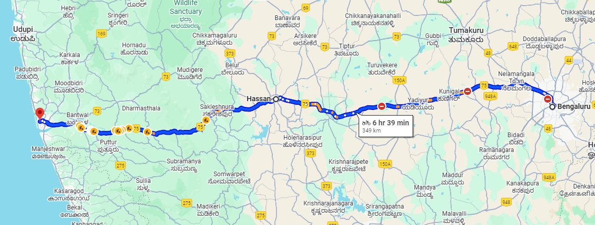
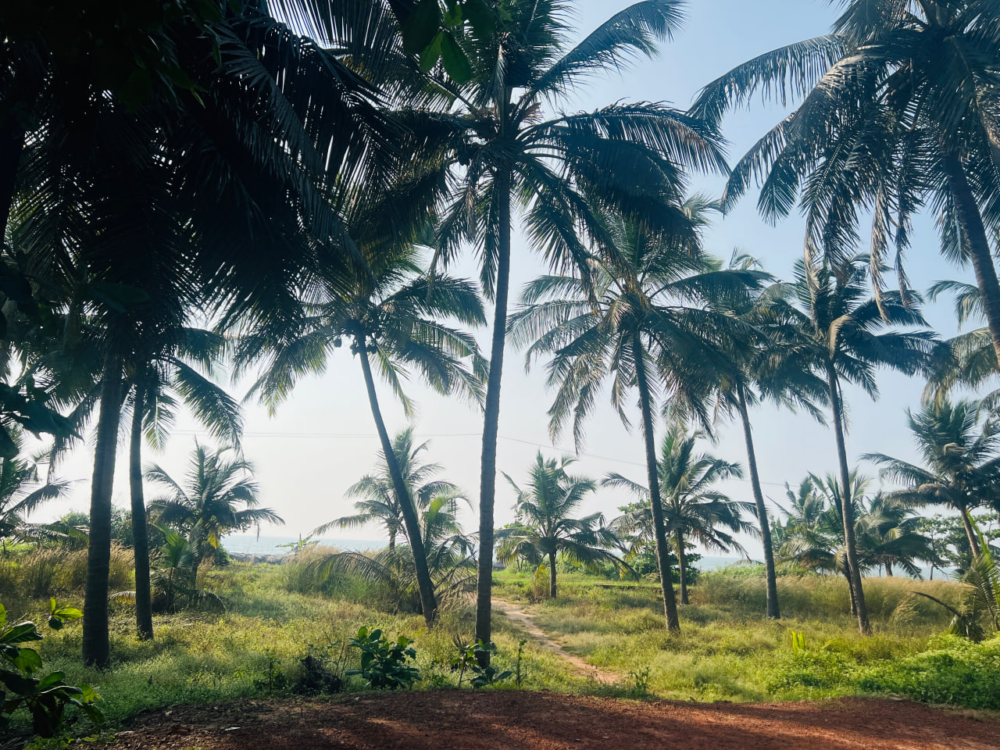
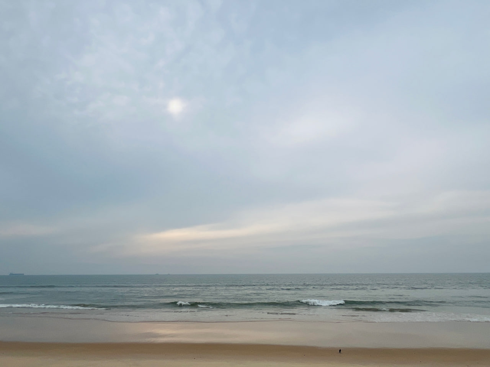

+++
author = "Abhishek AN"
title = "Riding to the Coast: Bengaluru to Mangaluru on Two Wheels"
date = "2025-11-30"
summary = "Discover what it's like to ride from Bengaluru to Mangaluru on a Royal Enfield Himalayan 411, with route details, ghat roads, coastal highlights, pillion experience, and lessons learned from a 1177 km motorcycle trip."
tags = [
    "Travel",
    "Bike Ride",
    "Himalayan 411",
    "Royal Enfield"
]
categories = [
    "Travel",
]
keywords = [
    "Bengaluru to Mangaluru bike ride",
    "Bangalore to Mangalore ride",
    "Western Ghats motorcycle trip",
    "Himalayan 411 long ride",
    "Royal Enfield travel stories",
    "Karnataka bike trip",
    "Coastal ride India",
    "Bangalore motorcycle travel blog",
    "Pillion travel experience",
    "NH75 Shirady Ghat ride"
]
+++

I recently completed a four-day ride from Bengaluru to Mangaluru with my partner, and it turned out to be one of the most surreal experiences I’ve ever had on a motorcycle. This was my first long ride with a pillion, and I genuinely couldn’t have asked for a better companion. We covered a total of 1177 kilometres not fast, not the cheapest trip, nothing too fancy but it felt real. It felt alive. The kind of ride where you’re constantly surrounded by the lush green of the ghats, the smell of damp earth, the blue stretch of the sea, and long empty roads that make you feel like time has slowed down just a little.

Riding with a pillion changes the rhythm of the journey. It makes you a bit more careful, a bit more responsible, but it also adds warmth, shared silences, and those little mid-ride conversations that happen only when you’re out there in the middle of nowhere with someone who trusts you completely. Even with the occasional chaos, it felt like the kind of trip you look back on years later and smile.

Before the ride, we thought we were prepared. Turns out we weren’t.
We didn’t carry a single maintenance item for my Himalayan 411. No puncture kit, no tools, not even a chain cleaner or lube. Looking back now, it sounds ridiculous, but at the time we didn’t think much of it. With patched-up road sections that were uneven and unpredictable, and long stretches with barely any help in sight, I kept thinking about how badly things could have gone if we had a flat tyre or a mechanical hiccup in the middle of the ghats. It was a small lesson wrapped inside a big journey be prepared, always.

But despite the small scares, the ride was everything we hoped it would be. Nothing extravagant, nothing overly planned. Just two people, a bike, the open highway, and the kind of moments that remind you why traveling slowly is underrated.

This was the route we took:
Bengaluru → Hassan → Sakleshpur → Mangaluru and back via the same route

## Day 1. Bengaluru to Mangaluru

I recently went on a short 4-day bike ride with my partner from Bengaluru to Mangaluru. We packed light for the most part or at least I did. We carried one 80L rucksack and a Viaterra tank bag and set off at around 6:30 AM. Once we crossed Nelamangala, it was pretty much straight on NH75.shared songs

We stopped for breakfast at Paakashala around 8 AM and later made another small stop at A2B before Hassan just to stretch our legs. It was smooth riding until a few kilometres after Sakleshpur when we noticed our rucksack had slipped and was almost falling off. We pulled over to adjust it and in the process, while getting off the bike, my leg got caught in the luggage and I ended up dropping the bike. A bit of petrol had leaked out and for a moment I was worried about damage to the engine or tank.

A few locals came over, helped us lift the bike, and told us about the nearest petrol bunk back in Sakleshpur. Once the bike was up, I was relieved to see that nothing major had happened apart from the right mirror bending out of shape.

Since we had no puncture kit, repair kit, or anything remotely useful with us, we rode back to Sakleshpur, filled up fuel, and found a mechanic nearby. He checked everything and assured me there was nothing to worry about the petrol had just leaked from the tank lid opening.

Feeling a bit more confident, we continued towards the Shirady Ghat. The roads until Hassan were great and even the ghat stretch was good, but the highway closer to Mangaluru was partly under construction. Some sections felt more like off-roading than highway riding, and on those muddy, uneven patches, I kept thinking, “What if the tyre gets punctured now?”

We reached Mangaluru around 2:30 PM. The last stretch felt never-ending and by the time we got there, we were exhausted. We headed straight into a Domino’s and attacked our lunch like we hadn’t seen food in days. Our stay was just 15 minutes away and the best part it was right in front of Chithrapura Beach. We checked in, took some much-needed rest, and spent the rest of the evening relaxing. Later we rode to the city centre for dinner, and after coming back, crashed immediately.

- 
- 

## Day 2. Mangaluru to Murudeshwara and back

Today was the day we were heading to the Sri Murudeshwara Shiva Temple. We left around 6:30 AM and got onto NH66 one straight line all the way. We stopped at Udupi for breakfast and had some really good idlis and dosas before continuing onward.

A little further ahead we stopped briefly at Maravanthe Beach, just for a few minutes, to stretch and take in the view. When the Arabian Sea is literally beside you as you ride, you can’t not stop. We reached the temple around 10 AM.

The ride back was on the same route, but this time we had a plan to stop at beaches along the way. We went back to Maravanthe and spent more time there, clicked some photos, and sat at the Café Coffee Day nearby to unwind.

Then we continued towards Udupi again and made a stop at Malpe Beach. It was bright and sunny, so we got ourselves ice golas and sat on a bench, watching the waves. Simple, peaceful moments.

By around 4:30 PM we were back at our stay. Another calm evening by the beach.

## Day 3. A day for nothing but chilling

We didn’t explore much today this was meant to be a slow day. We went to Nexus Mall, wandered around, and later headed out for dinner. As soon as we finished eating, it started pouring like crazy. We waited for nearly half an hour for it to stop, but it didn’t. Eventually we accepted our fate and rode 20 minutes in heavy rain back to our stay.

For a moment I thought this rain was going to ruin our return journey, but as with most coastal weather it doesn’t take long for things to change.

## Day 4. Mangaluru to Bengaluru

Mangaluru had been surreal. Neither of us wanted to say goodbye. After some last-minute packing and tying down the luggage again carefully this time we left around 6:30 AM. We followed the same route back, stopping three times for breakfast, tea, and lunch.

The return journey was more relaxed, except for one long upward climb on the ghat where our luggage kept threatening to fall off again. But apart from that, the ride was peaceful.

We reached Bengaluru around 2:15 PM, bringing an end to a short but memorable trip.
