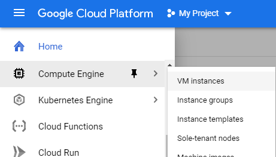
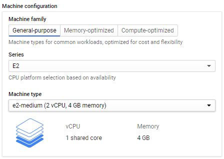
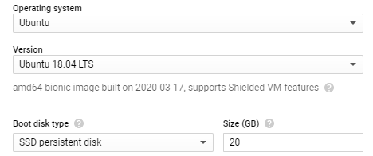
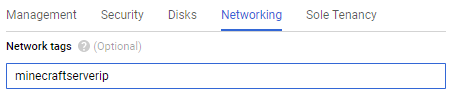
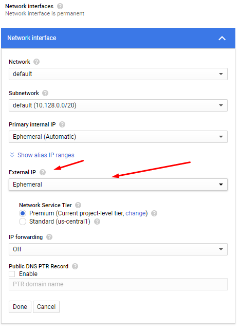
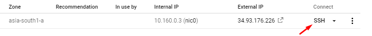
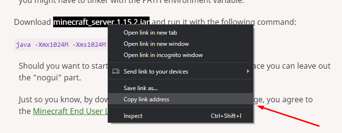

+++
author = "Abhishek AN"
title = "Setup Minecraft Server On Google Cloud Platform"
date = "2020-03-30"
summary = "Learn how to quickly set up and run a Minecraft server on Google Cloud Platform with this easy covering VM setup, networking, and optimization."
tags = [
    "Google",
    "GCP",
    "Minecraft",
    "Server"
]
categories = [
    "GCP",
    "Minecraft"
]
+++

Firstly, you need a Google cloud platform account with credits in it. 

Available here: http://cloud.google.com/

You get $300 worth of free credits, so you don't have to worry about it for this tutorial as it won't be using up much.

Go to Google Cloud Platform console and using the navigation drawer on the left navigate to 

Compute Engine &rarr; VM Instance



# Creating an instance

1. Click on create instance
2. Give a name to your instance, I'll choose `minecraftubuntu`
3. Select region and zone as per your wish. Note: Different regions have different pricing.
4. Choose a machine configuration, we do not require anything demanding for a small minecraft server. A machine with 4GB RAM should suffice. I will be choosing from the E2 series and e2-medium machine type with 2 vCPU, 4GB memory.

    
5. As the boot disk I will be allocating 20GB space and choosing an SSD. For the operating system, I will choose Ubuntu and version 18.04 LTS.

    
6. Scroll down and then click on

    
7. Go to the networking tab and fill in the network tag with a word that you will remember. So I will be typing in `minecraftserverip`

    
8. Now we need to create a static IP address for our instance, as we do not want our server to get a new IP address everytime it is switched on.

    Click on default under network interfaces and it should extend.
9. Here click on the dropdown under External IP and select create IP address and a new dialog box should open.

    
10. Give a name to your new static IP address, I'll choose `minecraftstatic` and click on reserve.
11. That should be it now click on create at the bottom of the page.

# Setting Firewall Rules

1. Using the navigation drawer on the left navigate to 

    VPC Network &rarr; Firewall Rules
2. Click on create firewall rule at the top.
3. Give a name, I'll choose `minecraftservertcp`.
4. Now scroll down in the target tags, type in the name we gave in Step 7 of Creating an instance. So that will be `minecraftserverip`.
    
    This means that all the instances that use the above networking tag will follow this firewall rule.
5. Fill in the source IP ranges with

    ```
    0.0.0.0/0
    ```
6. In protocols and ports, select Specified protocols and ports and then check the checkbox of TCP and type in `25565` which is the minecraft port.
7. Click on create.

# Logging in into the instance
1. Go to VM instances page and press the SSH button under the connect tab.

    
2. A new window should open connecting you to the VM.

    Let us first update the VM type in,
    ```
    sudo apt update && sudo apt upgrade
3. After updating create a folder where we will be storing and running our minecraft server from.

    ```
    mkdir mineserver
    cd mineserver
    ```
4. Now install java using 
    
    ```
    sudo apt install default-jre
    ```
5. We need to get the Minecraft server jar file now. There are many versions you can get the latest from 

    [Official Minecraft](https://www.minecraft.net/en-us/download/server/)

    If you need older versions you can visit [MCVERSIONS](https://mcversions.net/)

    You can get modded servers such as spigot from [Spigot Download](https://getbukkit.org/download/spigot).

6. For this tutorial I will be using the latest from official Minecraft.

    Copy the link address from the webpage

    

    And in the VM type in 
    ```
    wget https://launcher.mojang.com/v1/objects/bb2b6b1aefcd70dfd1892149ac3a215f6c636b07/server.jar
    ```

    This will download the latest server into your mineserver folder.
7. Now we can run the server by typing 

    ```
    java -Xmx3072M -Xms1024M -jar minecraft_server.1.15.2.jar nogui
    ```

    Here note the option -Xmx is the maximum RAM allocation and option -Xms is the minimum RAM allocation. I have allocated a maximum of 3GB and a minimum of 1GB.

    Click enter.
8. You will notice that after few lines of execution it will stop, that is because you need to agree to the EULA - End User License Agreement. For that using any text editor open the eula.txt that is automatically generated when the server is run for the first time.

    I will be using nano, so type in
    ```
    nano eula.txt
    ```
    Find the variable that has false and change it to true. To save the file press

    CTRL+O  and press enter

    To exit editing the file press

    CTRL+X
9. Now run the server using the previous java command. Wait for a while you will see that it is done.

# Connecting to server
Open up Minecraft, select multiplayer, click on add server. Give a server name you like and in the server address copy the IP address under the External IP tab in the VM instances page.

That's it. Enjoy playing with your friends on the server by giving them the IP address!

## Additional Information

[Editing server.properties file](https://minecraft.gamepedia.com/Server.properties)


[Spigot & Craftbukkit](https://getbukkit.org/)

[Plugins](https://getbukkit.org/)